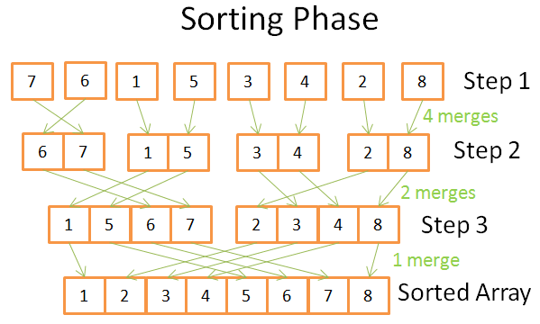
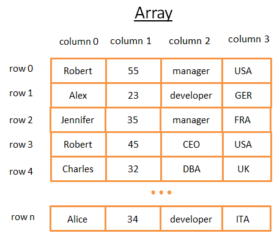
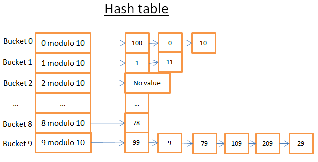

首先：感谢Christophe Kalenzaga，他对数据库的不了解，而想去了解这个对很多程序员来说的黑盒子，阅读了大量的文章，官方文档，研究资料，完成了本文。
本文的源地址在（[ How does a relational database work ](http://coding-geek.com/how-databases-work/)）

# 关系型数据库如何运行

当提到关系数据库，不由自主地认为缺少了些重要信息。这些数据库无所不在，发挥着他们的作用，他们包括了小巧的sqlite,强大的Teradat。但是少有文章去说明数据的运行原理。你可以搜索 “how does a relational database work”【关系数据库运行原理】来了解这样的文章有多么少。如果你去搜索现在这些流行技术（大数据，Nosql和javascript），你会找到大量深入的文章在说明这些技术的运行原理。关系数据库太不流行太没意思，以至于出了大学课堂，就找不到书和研究资料去阐明它的运行原理？<br/>


作为一个开发者，我非常不喜欢用一些我不理解的技术/组件。即使数据库已经经过了40年运用的检验，但是我依然不喜欢。这些年，我花费了上百小时的时间去研究这些每天都用的奇怪的黑匣子。**关系型数据库**的有趣也因为他门构建在**有效和重用的理念**上。如果你要了解数据库，而有没有时间或者没有毅力去了解这个宽泛的话题，那么你应该阅读这篇文章。<br/>

虽然文章标题已经足够明确，**本文的目的不是让你学习怎么使用一个数据库**.但是,**你应该已经知道怎么写一个简单的连接查询和基本的增删改查的查询**，否则，你就不能明白本文。**这就是现在必须要知道**，我将解释为什么需要这些提前的知识。<br/>

我将从时间复杂度开始开始这些计算机科学知识。当然当然，我晓得有些朋友不喜欢这些观点但是不了解这些，我们就不明白数据库中使用的技巧。这是一个庞大的话题，我将**聚焦于**非常必要的知识上，**数据库处理SQL查询的方法**。我将只涉及**数据库背后的基本观念**，让你在本文结束的时候**了解水面下发生了什么**。<br/>

这是一篇又长又有技术性的文章，涉及了很多算法和数据结构，总之不怎么好理解，慢慢看吧同学。其有一些观点确实不容易理解，你把它跳过去也能得到一个比较全面的理解（译者注：这篇博文对于学习过《数据结构》的同学，不算是很难，即使有一些难以理解的观点，要涉及技术的特性，这是使用这些许技的原因，对应能够明白使用技术要达成的结果）。<br/>

本文大体分为3个部分，为了方便理解：

+   底层技术和数据库模块
+   查询优化技术
+   事物和内存池管理

[TOC]
<br>
<br>
##回归基础
很久以前（估计有银河系诞生那么久远...），开发人员不得不精通非常多的编程操作。因为他们不能浪费他们龟速电脑上哪怕一丁点儿的CPU和内存，他们必须将这些算法和相应的数据结构深深的记在心里。
<br>
在这个部分，我将带你们回忆一些这样的概念，因为它们对于理解数据库是非常必要的。我也将会介绍**数据库索引**这个概念。
<br>
<br>
###O(1)) vs O(n<sup>2</sup>)  

现在，许多开发者不再关心时间复杂度...他们是对的！
<br>
但是当你们正面临着一个大数据量（我谈论的并不是几千这个级别的数据）的处理问题时或者正努力为毫秒级的性能提升拼命时，理解这个概念就非常的重要了。可是你们猜怎么着？数据库不得不处理这两种极端情况！我不会占用你们太多时间，只需要将这个点子讲清楚就够了。这将会帮助我们以后理解**成本导向最优化**的概念。
<br>
<br>
####基本概念 
**时间复杂度时用来衡量一个算法处理给定量的数据所消耗时间多少的**。为了描述这个复杂事物，计算机科学家们用数学上的大写字母O符号.这个符号用来描述了在方法中一个算法需要多少次操作才能处理完给定的输入数据量。
<br>
例如，当我说”这个算法是在O(some_funtion())“时，这意味着这个算法为了处理确定量的数据需要执行some_function(a_certain_amount_of_data)操作.
<br>
**最重要的**不是数据量，而是**随着数据量的增加，操作步骤需要随之变化的方式**。时间复杂度不是给出确切的操作数量而是一个概念。
    

在上图中，你可以看到不同类型的复杂度演变的方式。我用了对数尺度来描绘。换句话讲，当数据的量从1到10亿，我们可以看到：
* <font color="#00ff00" >O(1)</font>即常数复杂度保持常数操作数（不然它就不叫常数复杂度了）。
* <font color="#ff0000" >O(log(n))</font> **即使是上亿级的数据仍保持较低操作数**。
* 最差的复杂度是<font color="#ff00ff">O(n<sup>2</sup>)</font> **,它的操作数是爆炸式增长**。
* 另外两种复杂度增长快速。
      
<br>
####举例
当小数据量时，O(1)与O(n<sup>2</sup>)之间的差距是微乎其微的。例如，假设你需要处理2000条数据的算法。
* O(1)算法需要1次操作
* O(log(n))算法需要7次操作
* O(n)算法需要2000次操作
* O(n*log(n))算法需要14000次操作
* O(n<sup>2</sup>)算法需要4000000次操作
     
O(1)与O(n<sup>2</sup>)之间的区别似乎非常大（4百万倍），但是你实际上最多多消耗2毫秒，和你眨眼的时间几乎相同。的确，现在的处理器能处理[`每秒数以百万计指令`](https://en.wikipedia.org/wiki/Instructions_per_second)。这就是为什么在许多IT工程中性能和优化并不是主要问题的原因。
<br>
<br>   
正如我所说，当面对海量数据时，了解这个概念还是非常重要的。如果这时算法需要处理1000000条数据（对于数据库来说，这还不算大）：
* O(1)算法需要1次操作
* O(log(n))算法需要14次操作
* O(n)算法需要1000000次操作
* O(n*log(n))算法需要14000000次操作
* O(n<sup>2</sup>)算法需要1000000000000次操作

我没有详细算过，但是我想如果采用O(n<sup>2</sup>)算法，你可以有时间来杯咖啡了（甚至再来一杯！）。如果你又将数据数量级提升一个0，你可以有时间去打个盹儿了。
<br>
<br>
####继续深入
给你一个概念：
* 从一个哈希表中进行元素查找操作的复杂度是O(1)
* 从一个平衡树中进行查找操作的复杂度时O(log(n))
* 从数组中进行一次查找操作的复杂度O(n)
* 最优的排序算法的复杂度是O(n*log(n))。
* 差的排序算法的复杂度是O(n<sup>2</sup>)    

注意：在之后的内容中，我们将会看到这些算法和数据结构。
<br>
<br>
存在着多种种类的时间复杂度：
* 平均情况
* 最优情况
* 以及最差情况
   
时间复杂度经常是最差情况。
<br>
我仅讨论时间复杂度，实际上复杂度还适用于：
* 算法的内存消耗
* 算法的磁盘I/O消耗

当然也有比n<sup>2</sup>还差的复杂度情况，例如：
* n<sup>4</sup>：糟糕透了！我将会提到一些如此复杂度的算法。
* 3<sup>n</sup>：不能再糟了! 我们在本文中间部分将会看到这样复杂度的一个算法(而且在许多数据中，它确实在被使用着)。
* n的阶乘 : 即使是很小数量级的数据，你也将永远得不到你想要的结果。
* n<sup>n</sup>: 如果你最终的结果是这个算法复杂度，你应该好好问问自己到底是不是做IT的…    
  
注意：我并没有给你O符号的真正定义，而只是抛出这个概念。如果你想找到真正的定义，你可以阅读这篇[`WikiPedia材料`](https://en.wikipedia.org/wiki/Big_O_notation)。
<br>
<br>
###归并排序
如果你需要排序一个集合，你会怎么做？什么？你会调用sort()函数... 好吧，真是个好答案...但是对于数据库来说，你必须懂得sort()函数是如何工作的。

因为有太多好的排序算法，所以我将专注于最重要的一个：**归并排序**。此时此刻你可能不是很明白为什么数据排序会有用，但是当完成这个部分的查询优化后，你肯定会懂得。进一步来说，掌握归并排序将有助于后续我们对一般数据库中合并连接操作的理解。
<br>
<br>
####合并
  
如同许多有用的算法，归并排序是基础的技巧：合并2个长度为N/2的有序数组为一个有N个元素的有序数组仅消耗N次操作。这个操作称为一次合并。

让我们通过一个简单例子来看看其含义：


你能从图中看到最终排序好8个元素的数组的结构，你仅需要重复访问一次2个4元素数组。因为这2个4元素数组已经排序好了：
* 1) 你需要比较两个数组当前的元素（第一次的时候current=first）
* 2) 接下来将最小的那个放进8元素数组中
* 3) 将你提取最小元素的那个数组指向下一个元素
* 重复1，2，3步骤，直到你到达任何一个数组的最后一个元素.
* 接下来，你需要将另外一个数组的剩余元素放进8元素数组中。
   
这个算法之所以生效是因为4元素数组都是已经排序好的，因此你不必在这些数组中进行"回退"。

现在我们懂得了这个技巧，如下所示是我的合并排序伪代码。     
```shell
array mergeSort(array a)
   if(length(a)==1)
      return a[0];
   end if
 
   //recursive calls
   [left_array right_array] := split_into_2_equally_sized_arrays(a);
   array new_left_array := mergeSort(left_array);
   array new_right_array := mergeSort(right_array);
 
   //merging the 2 small ordered arrays into a big one
   array result := merge(new_left_array,new_right_array);
   return result;
```     
归并排序将问题拆分为更小的问题，再求解这些小问题结果，从而获得最初的问题结果（注意：这类算法叫做分治法）。如果你不懂这个算法，不用担心；我最初看这个算法时也是不懂。我将这个算法看作两个阶段算法，希望对你们有所帮助：
* 将一个数组才分为更小的数组称为分解阶段    
* 将小的数组组合在一起（使用合并）组成更大的数组称为排序阶段。
     
<br>
####分解阶段
       
在分解阶段中，数组被拆分为单一的数组用了3步。步骤数量的表达式为log(N)(由于 N=8，log(N) ＝ 3)。
   
我是怎么知道的呢？

~~我是个天才！~~总之：数学。每一步的核心是将最初的数组长度对半拆分。步骤数量就是你能二分原始数组的次数。这就是对数的定义（以2为底）。
<br>
<br>
####排序阶段
    

在排序阶段中，你将从单一数组开始。在每一步中，你使用多重汇集。总共需要N=8次操作：    
* 第一步，你将做4次合并，每次需要2步操作
* 第二步，你将进行2次合并，每次需要4步操作
* 第三步，你将做1次合并，每次需要8步操作
 
因为总共有log(N)个步骤，**总共需要N * log(N)次操作**。
<br>
<br>
####归并排序的威力    
    
为什么这个算法有如此威力？    

缘由如下：    
* 你可以将它改造为低内存占用型，通过不再建立一个新的数组而是直接修改输入数组。
注意：这种算法称为[原地算法](https://en.wikipedia.org/wiki/In-place_algorithm)
* 你可以将它改造为使用磁盘空间和更小的内存占用的同时，避免大量的磁盘I/O消耗。这个算法的理念是每次只加载当前处理的部分数据进入内存。当你只有100M内存空间却需要对数G大小的表进行排序时，这个算法将十分重要。
注意：这种算法称为[外部排序](https://en.wikipedia.org/wiki/External_sorting)。
* 你可以将这个算法改造为运行在多处理器/线程/服务器。
例如，分布式归并排序就是[`Hadoop`](https://hadoop.apache.org/docs/stable/api/org/apache/hadoop/mapreduce/Reducer.html)的核心模块（一种大数据框架）。
* 这个算法能点石成金（真的！）。   
      
这个排序算法应用于大多数（好吧，如果不是全部）数据库，但是它不是唯一的。如果你想了解更多，你可以阅读这个[研究材料](http://wwwlgis.informatik.uni-kl.de/archiv/wwwdvs.informatik.uni-kl.de/courses/DBSREAL/SS2005/Vorlesungsunterlagen/Implementing_Sorting.pdf)，这里面讨论了数据库中所使用到的通用排序算法的优缺点。
<br>
<br>
###数组，树以及哈希表

我们已经了解时间复杂度和排序背后的机理，我必须给你讲3种数据结构。它们十分重要，因为它们是**现代数据库的支柱**。同时我也会介绍**数据库索引**。
<br>
<br>
####数组
   
二维数组是最简单的数据结构。表格也能看成是一个数组。如下：
    
二维数组就是一个行列表：
* 每行表示一个对象
* 列表示描述对象的特性
* 每列存储一种特定类型的数据(整型，字符串，日期 ...)。    

尽管这样存储和数据可视化都非常好，但是当你面对特殊数据时，这个就很糟了。
  
例如，**如果你想找到所有工作在英国的人**，你将不得不查看每一行看这一行是否属于英国。**这将消耗你N步操作**（N是行数），这并不算太坏，但是否又有更好的方式呢？这就是为什么要引入tree。 

注意：大多数现代数据库提供了增强型数组来高效的存储表单，例如：堆组织表或索引组织表。但是他并没有解决特殊值在列集合中的快速查找问题。
<br>
<br>
####树和数据库索引

二叉搜索树时一种带有特殊属性的二叉树，每个节点的键值必须满足：
* 大于所有左子树的键值
* 小于所有右子树的键值
 
让我们直观的看看上面的含义
<br>
<br>
**概念**

 
这棵树有 N=15 个节点构成。假设我们搜索208：
* 我将从根节点的键值136开始，因为136<208，所以我们查找136节点的右子树。
* 398>208 所以，我们查找398节点的左子树
* 250>208 所以，我们查找250节点的左子树
* 200<208 所以，我们查找200节点的右子树。但是200节点没有右子树，**这个值不存在**（如果它存在，那么它必定在200节点的右子树中)

接下来假设我们查找40    
* 我将从根节点的键值136开始，因为136>40，所以我们查找136节点的左子树。
* 80>40 所以，我们查找80节点的右子树
* 40=40，**节点存在**。提取出节点的行号(这个没在图上)，然后根据行号查询数据表。
* 获得了行号，我们就可以知道数据在表上的精确位置，因此我们就能立即获取到数据。
 
最后，这两个查询都消耗树的层数次操作。如果你仔细地阅读了归并排序部分，那么就应该知道这里是log(N)层级。所以知道**搜索算法的时间复杂度是log(N)**，不错！
<br>
<br>
**回到我们的问题上**

但是这些东西还是比较抽象，我们回到我们具体的问题中。取代了前一张表中呆滞的整型，假想用字符串来表示某人的国籍。假设你又一棵包含了表格中“国籍”列的树：
* 如果你想知道谁在英国工作
* 你查找这棵树来获取代表英国的节点
* 在“英国节点”中，你将找到英国工人的行地址。    
   
这个查找仅需要log(N)次操作而不是像使用数组一样需要N次操作。你们刚才猜想的就是**数据库索引**。

只要你有比较键值（例如 列组）的方法来建立**键值顺序**（这对于数据库中的任何一个基本类型都很重要），你可以建立任意列组的树形索引（字符串，整型，2个字符串，一个整型和一个字符串，日期...）。
<br>
<br>
####B+树索引

尽管树形对于获取特殊值表现良好，但是当你需要**获取在两个值范围之间的多条数据**时还是存在着一个大问题。因为你必须查询树种的每个节点看其是否在两值范围之间（例如，顺序遍历整棵树）。更糟的是这种操作很是占用磁盘I/O，因为你将不得不读取整棵树。我们需要找到一种有效的方式来做**范围查询**。为了解决这个问题，现代数据库用了一个之前树形结构的变形，叫做B+树。在B+树中：
* 仅只有最底层的节点(叶子节点)存储信息（相关表的行坐标）
* 其他节点仅在搜索过程中起导向到对应节点的作用。    


如你所见，这将引入更多的节点（两倍多）。的确，你需要更多额外的节点，这些“决策节点”来帮助你找到目标节点（存储了相关表的行坐标信息的节点）。但是搜索的复杂度仍然是O(log(N))（仅仅是多了一层）。最大的区别在于**最底层的节点指向了目标**。   


假设你使用B+树来搜索40到100之间的值：
* 你必须像上一树形结构中一样查找40的值（或者如果40不存在，就找最接近40的值）。
* 40的结果集合直接链接了直到100的结果。

假设你找到了M个结果，并且整棵树有N个节点。如同上一树形结构一样查找特殊节点需要log(N)步操作。但是一旦你找到这个节点，你就可以通过指向他们结果集的M步操作来获取M个结果。**这样的查找方式仅需要M + log(N)步操作**相对于上一棵树形结构中的N步操作。更好的是你不必讲整棵树读取进来（只需要读取M + log(N) 个节点），这意味着更少的磁盘消耗。如果M足够小（比如200行）而N足够大（1 000 000行），这会产生巨大的差别。
<br>
<br>
但是又会产生新的问题（又来了！）。如果你在数据库中增加或删除一行（与此同时在相关的B+树索引中也要进行相应操作）：
* 你必须保证B+树中的节点顺序，否则你不能在混乱中找到目标节点。
* 你必须保证B+树中尽可能最小的层数，否则时间复杂度会从O(log(N))变为O(N)。

换句话说，B+树需要是自生顺序的和自平衡的。幸好使用智能删除和插入操作，这些都是可行的。但是这就引入了一个消耗：在一个B+树中的插入操作和删除操作的复杂度都是O(log(N))。这就是为什么你们有些人听说的**使用太多的索引并不是一个好办法**的原因。确实，**你降低了在表中行的快速插入/更新/删除**，以为数据库要为每个索引更新数据表的索引集都需要消耗O(log(N))次操作。更糟的是，添加索引意味着**事务管理**(我们将在本文最后看到这个管理)更多的工作量。

更多详情，可以查看维基百科[`B+树资料`](https://en.wikipedia.org/wiki/B%2B_tree)。如果你想知道数据库中B+树的实现细节，请查看来自MySQL核心开发者的[`博文`](http://blog.jcole.us/2013/01/07/the-physical-structure-of-innodb-index-pages/)和[`博文`](http://blog.jcole.us/2013/01/10/btree-index-structures-in-innodb/)。这两个材料都是聚焦于innoDB(MySQL数据库引擎)如何处理索引。    

注意：因为我被一个读者告知，由于低级优化，B+树需要完全平衡。
<br>
<br>
####哈希表
我们最后一个重要的数据结构是哈希表。当你想快速查找值的时候这会非常有用。更好的是了解哈希表有助于掌握数据库通用连接操作中的**哈希连接**。这个数据结构也用于数据库存储一些中间量（如我们稍后会提到的**锁表**或**缓冲池**概念）。

哈希表是一种利用其键值快速查找元素的数据结构。为了建立哈希表，你需要定义：
* 为元素建立的**键**
* 为键建立的**哈希方法**。为键算出的哈希值可以定位元素（称为哈希桶）。
* **键之间的比较方法**。一旦你找到了目标桶，你必须使用这个比较方法来查找桶内的元素。
   
<br>
**一个简单例子**

让我们来看看图形示例：


这个哈希表有10个哈希桶。换句话说，我只使用元素的最后一个数字来查找它的哈希桶：
* 如果元素的最后一个数字是0，那么就存在于0号哈希桶中，
* 如果元素的最后一个数字是1，那么就存在于1号哈希桶中，
* 如果元素的最后一个数字是2，那么就存在于2号哈希桶中，
* ...

我所使用的比较方法仅仅是简单的比较2个整型是否相等。    
假设你想查找一个78的元素：
* 哈希表首先计算出78的哈希值是8。
* 接下来它查看8号哈希桶，并找到第一个元素就是78。
* 它就返回给你78的元素
* **这次查找仅需要2步操作**（1步是计算哈希值而另一步则是查找哈希桶里面的元素）。

接下来，假设你想找到59的元素：
* 哈希表首先计算59的哈希值为9。
* 它查找9号哈希桶，第一个找到的元素是99。因为99!=59，99元素不是目标元素。
* 使用相同的逻辑，它找到第二个元素(9)，第三个(79)，...，直到最后一个(29)。
* 该元素不存在。    


<br>
**优秀的哈希方法**

如你所见，根据你查找的值不同，消耗也是不同的！    

如果现在我改用键值除以1 000 000的哈希方法（也就是取最后6位数字），第二个查找方法仅需要1步操作，因为不存在000059号的哈希桶。**真正的挑战是找到一个创建能容纳足够小元素的哈希桶的哈希方法**。

在我的例子中，找到一个好的哈希方法是非常容易的。但是由于这是个简单的例子，当面对如下键时，找到哈希方法就非常困难了：
* 字符串(例如人的姓氏)
* 2个字符串(例如人的姓氏和名字)
* 2个字符串和一个日期(例如人的姓氏，名字以及生日)
* ...    

**如果有一好的哈希方法，在哈希表中查找的复杂度将是O(1)**。
<br>
<br>
**数组与哈希表的比较**   

为什么不使用数组?    
嗯, 你问了一个好问题。    
* 哈希表能**一半在内存中加载**，而其余的哈希桶保存在磁盘上。
* 如果使用数组，你必须使用内存中的连续内存。如果你正在加载一张较大的表，系统是**很难分配出足够大的连续空间的**。
* 如果使用哈希表，你可以**任意选择你想要的键**(例如：国家 AND 姓氏)。 

想要更多的信息，你可以阅读我的博文一个高效哈希表的实现[`Java HashMap`](http://coding-geek.com/how-does-a-hashmap-work-in-java/)；你可以读懂这个文章内容而不必掌握Java。
<br>
<br>
##总体结构

我们已经理解了数据库使用的基本组件，我们需要回头看看这个总体结构图。<br/>
数据库就是一个文件集合，而这里信息可以被方便读写和修改。通过一些文件，也可以达成相同的目的（便于读写和修改）。事实上，一些简单的数据库比如SQLite就仅仅使用了一些文件。但是SQLite是一些经过了良好设计的文件,因为它提供了以下功能：<br/>
+   使用事务能够保证数据安全和一致性
+   即使处理百万计的数据也能高效处理

一般而言，数据库的结构如下图所示:
<br/>

<br/>
在开始写之前，我曾经看过很多的书和论文，而这些资料都从自己的方式来说明数据库。所以，清不要太过关注我怎么组织数据库的结构和对这些过程的命名，因为我选择了这些来配置文章的规划。不管这些不同模块有多不一样，但是他们总体的观点是**数据库被划分为多个相互交互的模块**。<br/>

<u>核心模块:</u>
+  **进程管理器**: 很多的数据库都有进程/线程池需要管理，另外，为了达到纳秒级（切换），一些现代的数据库使用自己实现线程而不是系统线程。
+  **网络管理器**: 网络IO是一个大问题，尤其是分布式数据库。这就是一些数据库自己实现管理器的原因。
+  **文件系统管理器: 磁盘IO是数据库的第一性能瓶颈**。文件系统管理器太重要了，他要去完美使用OS文件系统，甚至自己取而代之。
+  **内存管理器**: 为了避免磁盘IO带来是惩罚，我们需要很大的内存。但是为了有效的使用这些内存，你需要一个有效率的内存管理器。尤其在多个耗内存的查询操作同时进行的时候。
+  **安全管理器**: 为了管理用户的验证和授权。
+  **客户端管理器**: 为了管理客户端连接..
+  .......

<u>工具类:</u>
+  **备份工具**: 保存和恢复一个数据库。
+  **恢复工具**: 使据据库在崩溃重启之后，重新达到一致性的状态。
+  **监控工具**: 记录数据库所有的行为，需要提供一个监控工具去监控数据库。
+  **管理工具**: 保存元数据（比如表的结构和名字），并提供工具去管理数据库，模式，表空间等等。
+  ......

<u>查询管理器:</u>
+  **查询解析器**: 确认查询是否合法
+  **查询重写器**: 优化查询的预处理
+  **查询优化器**: 优化查询语句
+  **查询执行器**: 编译执行一个查询
+  ......

<u>数据管理器:</u>
+  **事务管理器**: 管理事务
+  **缓存管理器**: 在使用数据或者修改数据之前，将数据载入到内存，
+  **数据访问**: 访问磁盘上数据


本文剩下部分，我将关注于数据库如何处理SQL查询的过程：
+  客户端管理器
+  查询管理器
+  数据管理器（我也将在这里介绍恢复管理工具）

<br/>
##客户端管理器
<br/>

<br/>
客户端管理器是处理和客户端交互的部分。一个客户端可能是（网页）服务器或者终端用户或者终端程序。客户端管理器提供不同的方法（广为人知的API: JDBC, ODBC, OLE-DB）来访问数据库。
当然它也提供数据库特有的数据库APIs。
<br/>
<br/>
当我们连接数据库：
+  管理器首先验证我们的身份（通过用户名和密码）接着确认我们是否有使用数据库的授权，这些访问授权是你们的DBA设置的。
+  接着，管理器确认是否有空闲的进程(或者线程)来处理你的这次请求。
+  管理器也要确认数据库是否过载。
+  管理器在得到请求的资源（进程/线程）的时候，当等待超时，他就关闭这个连接，并返回一个易读的出错信息。
+  得到进程/线程之后，就**把这个请求传递给查询管理器**，这次请求处理继续进行。
+  查询过程不是一个all or nothing的过程，当从查询管理器获取数据之后，就立刻将**这些不完全的结果存到内存中，并开始传送数据**。

+  当遇到失败，他就中断连接，返回给你一个**易读的说明**，并释放使用到的资源。

<br/>

##查询管理器

<br/>
**这部分是数据库的重点所在**。在本节中，一个写的不怎么好的查询请求将转化成一个**飞快**执行指令代码。接着执行这个指令代码，并返回结果给客户端管理器。这是一个多步骤的操作。
+  查询语句将被**解析**，看它是否有效。
+  接着在它之上去除无用的操作语句，并添加与处理语句，重写出来。
+  为了优化这个查询，提供查询性能，将它转化成一个可执行的数据访问计划。
+  编译这个计划。
+  最后，执行它。
<br/>
这部分，我不打算就爱那个很多在最后两点上，因为他们不是那么重要。
<br/>
<br/>

阅读完这部分之后，你将容易理解我推荐你读的这些材料：
<br/>

+  最初的基于成本优化的研究论文： [Access Path Selection in a Relational Database Management System](http://www.cs.berkeley.edu/~brewer/cs262/3-selinger79.pdf). 
这篇文章只有12页，在计算机科学领域是一片相对易懂的论文。

+  针对DB2 9.X查询优化的非常好，非常深深入的文档[here](http://infolab.stanford.edu/~hyunjung/cs346/db2-talk.pdf)

+  针对PostgreSQL查询优化的非常好的文档[here](http://momjian.us/main/writings/pgsql/optimizer.pdf)。这是非常容易理解的文档，它更展示的是“PostgreSQL在不同场景下，使用相应的查询计划”，而不是“PostgreSQL使用的算法”。

+  SQLite关于优化的官方[SQLite documentation](https://www.sqlite.org/optoverview.html) 文档。非常容易阅读，因为SQLite使用的非常简单的规则。此外，这是为唯一一个真正解释如何使用优化规则的文档。

+  针对SQL Server 2005查询优化的非常好的文档[here](https://blogs.msdn.com/cfs-filesystemfile.ashx/__key/communityserver-components-postattachments/00-08-50-84-93/QPTalk.pdf)

+  Oracle 12c 优化白皮书 [here](http://www.oracle.com/technetwork/database/bi-datawarehousing/twp-optimizer-with-oracledb-12c-1963236.pdf)


+  “DATABASE SYSTEM CONCEPTS”作者写的两个关于查询优化的2个理论课程[here](codex.cs.yale.edu/avi/db-book/db6/slide-dir/PPT-dir/ch12.ppt) and [here](codex.cs.yale.edu/avi/db-book/db6/slide-dir/PPT-dir/ch13.ppt). 关注于磁盘I/O一个很好的读物，但是需要一定的计算机科学功底。

+  另一个非常易于理解的，关注于联合操作符，磁盘IO的 [理论课](https://www.informatik.hu-berlin.de/de/forschung/gebiete/wbi/teaching/archive/sose05/dbs2/slides/09_joins.pdf)。

<br/>
##查询解析器
解析器会将每一条SQL语句检验，查看语法正确与否。如果你在SQL语句中犯了一些错误，解析器将阻止这个查询。比如你将"SELECT...."写成了"SLECT ...."，这次查询就到此为止了。
<br/>
说的深一点，他会检查关键字使用前后位置是否正确。比如阻止WHERE 在SELECT之前的查询语句。
<br/>
之后，查询语句中的表名，字段名要被解析。解析器就要使用数据库的元数据来验证：

+  **表**是否存在
+  表中**字段**是否存在
+  根据字段的类型，对字段的**操作可以**（比如你不能将数字和字符串进行比较，你不能针对数字使用substring()函数）


之后确认你是否有**权限**去读/写这些表。再次说明，DBA设置这些读写权限。
在解析过程中，SQL查询语句将被转换成一个数据库的一种内部表示(一般是树 译者注：ast)
如果一切进行顺利，之后这种表示将会传递给查询重写器
<br/>
##查询重写器
在这一步，我们已经得到了这个查询内部的表示。重写器的目的在:  

+   预先优化查询
+   去除不必要的操作
+   帮助优化器找到最佳的可行方案

<br/>
重写器执行一系列广为人知的查询规则。如果这个查询匹配了规则的模型，这个规则就要生效，同时重写这个查询。下列有几个(可选的)规则：

+  **视图合并：**如果你在查询仲使用了一个视图，这个视图将会被翻译成视图的SQL代码。
+  **子查询整理**：如果查询仲有子查询非常难以优化，冲洗器可能会去除这个查询的子查询。

例子如下：
<pre><code>
SELECT PERSON.*  
FROM PERSON  
WHERE PERSON.person_key IN  
(SELECT MAILS.person_key  
FROM MAILS  
WHERE MAILS.mail LIKE 'christophe%');  
</code></pre>
将会改写成：
<pre><code>
SELECT PERSON.*  
FROM PERSON, MAILS  
WHERE PERSON.person_key = MAILS.person_key  
and MAILS.mail LIKE 'christophe%';  
</code></pre>

+   **去除非必须操作符**： 比如如果你想让数据唯一，而使用DISTINCT的与此同时还使用一个UNIQUE约束。这样DISTINCT关键字就会被去除。
+   **消除重复连接**：如果查询中有两个一样的join条件，无效的join条件将被移除掉。造成两个一样join的原因是一次join的条件隐含在(view)视图中，也可能是因为传递性。
+   **确定的数值计算：** 如果你写的查询需要一些计算，那么这些计算将在重写过程。去个例子"WHERE AGE > 10 + 2"将会转换成 "WHERE AGE > 12"，TODATE("some date")将转化成datetime格式的日期。
+  "(高端功能)分区选择:" 如果你正在使用一个分过去的表，冲洗器会找到你要使用哪一个分区。
+  "(高端功能)实体化视图:"如果你的查询语句实体化视图

这时候，重写的查询传递给查询优化器。
好戏开场了。
<br/>
##统计
在看优化查询之前，我们必须要说一下**统计**，因为**统计是数据库的智慧之源**。如果你不告诉数据如何分析数据库自己的数据，它将不能完成或者进行非常坏的推测。
<br/>
数据库需要什么样的信息？
<br/>
我必须简要的谈一下，数据库和操作系统如何存储数据。他们使用一个称为**page**或者block(通常4K或者8K字节)的最小存储单元。这意味着如果你需要1K字节(需要存储)，将要使用一个page。如果一个页大小为8K，你会浪费其他的7K。
**注：**   

计算机内存使用的存储单元为page，文件系统的存储单元成为block    
K  -\> 1024    
4K -\> 4096    
8K -\> 8192   
<br/>
继续我们的统计话题！你需要数据库去收集统计信息，他将会计算这些信息：  

+  table中，行/page的数量
+  table中，列信息：
+  +  数据值distinct值
   +  数据值的长度(最小，最大，平均值)
   +  数据范围信息(最小，最大，平均值)

+  table的索引(indexes)信息  


**这些统计将帮助优化器去计算磁盘IO，CPU和查询使用的内存量**
<br/>
这些每一列的统计是非常重要的，比如：如果一个表 PERSON需要连接(join)两个列：LAST_ANME，RIRST_NAME。有这些统计信息，数据库就会知道RIRST_NAME只有1000个不同的值，LAST_NAME不同的值将会超过100000个。因此，数据库将会连接(join)数据使用LAST_ANME，RIRST_NAME而不是FIREST_NAME,LAST_NAME，因为LAST_NAME更少的重复，一般比较2-3个字符已经足够区别了。这样就会更少的比较。

<br/>
这只是基本的统计，你能让数据库计算**直方图**这种更高级的统计。直方图能够统计列中数据的分布情况。比如：

+  最常见的值
+  分布情况
+  .....
<br/>
这些额外的统计将能帮助数据库找到最优的查询计划。特别对等式查询计算(例：WHERE AGE = 18)或者范围查询计算(例：WEHRE AGE \> 10 and ARG \< 40)因为数据更明白这些查询计算涉及的行数（注：科技界把这种思路叫做选择性）。
<br/>
<br/>
这些统计数据存在数据的元数据。比如你能这些统计数据在这些(没有分区的)表中

+  Oracle的表USER/ALL/DBA_TABLES 和 USER/ALL/DBA_TAB_COLUMNS
+  DB2的表SYSCAT.TABLES 和 SYSCAT.COLUMNS  
 
<br/>
这些**统计信息必须时时更新**。如果出现数据库的表中有1000 000行数据而数据库只认为有500行，那就太糟糕了。统计这些数据有一个缺陷就是：**要耗费时间去计算**。这就是大多数数据库没有默认自动进行统计计算的原因。当有数以百万计的数据存在，确实很难进行计算。在这种情况下，你可以选择进行基本统计或者数据中抽样统计一些状态。
<br/>
比如：我正在进行一个计算表的行数达到亿级的统计工程，即使我只计算其中10%的数据，这也要耗费大量的时间。例子，这不是一个好的决定，因为有时候Oracle 10G在特定表特定列选择的这10%的数据统计的数据和全部100%统计的数据差别极大（一个表中有一亿行数据是很罕见的）。这就是一个错误的统计将会导致原本30s的查询却要耗费8个小时；找到导致的原因也是一个噩梦。这个例子战士了统计是多么的重要。
<br/>
<br/>
注：当然每种数据库都有他自己更高级的统计。如果你想知道更多请好好阅读这些数据库的文档。值得一提的是，我以前尝试去了解这些统计是如何用的，我发现了这个最好的官方文档 [one from PostgreSQL](http://www.postgresql.org/docs/9.4/static/row-estimation-examples.html)
<br/>
##查询优化器
<br/>

<br/>
所有的现代数据库都使用**基于成本优化(CBO)**的优化技术去优化查询。这个方法认为每一个操作都有成本，通过最少成本的操作链得到结果的方式，找到最优的方法去减少每个查询的成本。
<br/>
<br/>
为了明白成本优化器的工作，最好的例子是"感受"一个任务背后的复杂性。这个部分我将展示3个常用方法去连接(join)两个表。我们会快速明白一个简单连接查询是多么的那一优化。之后，我们将会看到真正的优化器是如何工作的。
<br/>
我将关注这些连接查询的时间复杂度而不是数据库优化器计算他们CPU成本，磁盘IO成本和内存使用。时间复杂度和CPU成本区别是，时间复杂度是估算的（这是想我这样懒人的工具）。对于CPU成本，我还要累加每一个操作一个加法、一个if语句，一个乘法，一个迭代...
此外：

+  一个高等级代码操作代表着一系列低等CPU操作。
+  一个CPU操作的成本不是一样的（CPU周期）。不管我们使用i7,P4,amd的Operon。一言以蔽之，这个取决于CPU架构。


使用时间复杂度太简单(起码对我来说)。使用它我们能轻易明白CBO的思路。我们需要讨论一下磁盘IO，这个也是一个重要的概念。记住：**通常情况，性能瓶颈在磁盘IO而不是CPU使用**。
<br/>
<br/>
##索引
<br/>
我们讨论的索引就是我们看到的B+树。记得吗？**索引都是有序的**。说明一下，也有一些其他索引比如**bitmap 索引**，他们需要更少的成本在CPU，磁盘IO和内存，相对于B+树索引。
此外，很多现代数据库当前查询**动态创建临时索引**，如果这个技术能够为优化查询计划成本。
<br/>
##访问路径
<br/>
在执行join之前，你必须得到你的数据。这里就是你如何得到数据的方法。
注：所有访问路径的问题都是磁盘IO，我将不介绍太多时间复杂度的东西。
<br/>

**全扫描**
<br/>
如果已经看个一个执行计划，你一定看过一个词**full scan**(或者just scan)。全扫描简单的说就是数据库读整个表或者这个的索引。**对磁盘IO来说，整表扫描可是性能耗费的要比整个索引扫描多得多**。
<br/>

**范围扫描**
<br/>
还有其他的扫描方式比如**索引范围扫描**。举一个它使用的例子，我们使用一些像"WHERE AGE \> 20 AND AGE \<40"计算的时候，范围就会使用。
<br/>
当然我们在字段AGE上有索引，就会使用**索引范围扫描**。
<br/>
我们已经在第一章节看到这个范围查询的时间复杂度就是Log(N)+M，这个N就是索引数据。M就是一个范围内行的数目的估算。**因为统计N和M都是已知**（注：M就是范围计算 AGE \>20 AND AGE\<40的选择性）。
此外，对一个范围查询来说，你不需要读取整个索引，所以**在磁盘IO上，有比全扫描有更好的性能**。
<br/>

**唯一扫描**
<br/>
你只需要索引中得到一个值，我们称之为唯一扫描
<br/>

**通过rowid访问**
<br/>
在大部分时间里，数据库使用索引，数据库会查找关联到索引的行。通过rowid访问可以达到相同的目的。
<br/>
举个例子，如果你执行
>  SELECT LASTNAME, FIRSTNAME from PERSON WHERE AGE = 28  

如果你有一个索引在列age上，优化器将会使用索引为你找到所有年龄在28岁的人，数据库会查找关联的行。因为索引只有age信息，而我们想知道lastname和firstname。
<br/>
但是，如果你要做这个查询
>SELECT TYPE_PERSON.CATEGORY from PERSON ,TYPE_PERSON WHERE PERSON.AGE = TYPE_PERSON.AGE

<br/>
PERSON上的索引会用来连接TYPE\_PERSON。但是PERSON将不会通过rowid进行访问。因为我们没有获取这个表的信息。
<br/>
即使这个查询在某些访问能够工作的很好，这个查询真真正的问题是磁盘IO。如果你需要通过rowid访问太多的行，数据库可能会选择全扫描。
<br/>

**其他方法**
<br/>
我不能列举所有的访问方法。如果你需要知道的更多，你可以去看。名字可能和其他数据库不一样，但是背后的机制是一样的。
<br/>

**连接操作符**
<br/>
我们知道如何获取我们的数据，我们连接他们！
<br/>
我列举3个常见的连接操作：归并连接，哈希连接和嵌套循环连接。再次之前，我需要介绍几个新名词：内部关系和外部关系。一个关系（应用在）：  

+  一张表
+  一个索引
+  一个中间结果通过明确的操作（比如一个明确连接结果）

当你连接两个关系，join运算不同的方式管理两种关系。在剩下的文章里边，我假设：  

+  外部关系是左侧数据集合
+  内部关系是右侧数据集合

举例, A join B 就是一个A-B连接查询，A是外部关系，B是内部关系。
<br/>
通常，**A join B的成本和B join A的成本是不一样的**。
<br/>
**在这部分，我假设外部关系有N个元素，内部关系有M个元素**。记住，一个真正的优化器通过统计知道N和M的值。
<br/>
注：N和M都是关系的基数。
<br/>

**嵌套循环连接**
<br/>
嵌套循环连接是最简单的。
<br/>

<br/>
这是思路：  

+  找外部关系中的每个元素
+  你将查找内部关系的所有行，确认有没有行是匹配的。

这是伪代码
<pre><code>
nested_loop_join(array outer, array inner)
    for each row a in outer
        for each row b in inner
            if (match_join_condition(a,b))
                write_result_in_output(a,b)
            end if
        end for
   end for
</code></pre>
这就是双重循环，**时间复杂度是O(N\*M)**
<br/>
从磁盘IO来说，外部关系的N行数据每一个行，内部循环需要读取M行数据。这个算法需要读N+N\*M行数据从磁盘上。但是，如果内部关系足够小，你就能把这个关系放在内存中这样就只有M+N
次读取数据。通过这个修改，**内部关系必须是最小的那个**，因为这样这个算法，才能有最大的机会在内存操作。
<br/>
从时间复杂度来说，它没有任何区别，但是在磁盘IO上，这个是更好的读取方法对于两者。
<br/>
当然，内部关系将会使用索引，这样对磁盘IO将会更好。
<br/>
<br/>
因为这个算法是非常简单，这也是对磁盘IO更好的版本，如果内部关系能够完全存放在内存中。这就是思路：  

+  不用读取一行一行的读取数据。
+  你批量的读取数据，保持两块数据（两种关系）在内存中。
+  你比较块中的每行数据，记录匹配的行
+  从磁盘读取新块，并比较数据
+  持续执行，直到数据执行完。

这是可行的算法:
<br/>

<pre><code>
// improved version to reduce the disk I/O.
nested_loop_join_v2(file outer, file inner)
    for each bunch ba in outer
    // ba is now in memory
        for each bunch bb in inner
        // bb is now in memory
            for each row a in ba
                for each row b in bb
                    if (match_join_condition(a,b))
                        write_result_in_output(a,b)
                    end if
                end for
            end for
        end for
    end for
</code></pre>

<br/>
**这个版本，时间复杂度是一样的，磁盘访问数据降低**：

+  前一个版本，这个算法需要N + N\*M 次访问（一次读一行）
+  新版本中，磁盘访问次数成了number_of_bunches_for(outer)+ number_of_ bunches_for(outer)\* number_of_ bunches_for(inner)。
+  如果你增加每个块的数量，就减少了磁盘访问次数。


注：比起前一个算法，一个数据库访问收集越多的数据。如果是顺序访问还不重要。（机械磁盘的真正问题是第一次获取数据的时间。）
<br/>
<br/>
**哈希连接**
<br/>
相对于嵌套循环连接，哈希连接更加复杂，但是有更好的性能，在很多情况下。

<br/>
哈希连接的思路为：  

+  1）获取所有的内部关系的所有元素。
+  2)创建一个内存hash表
+  3)一个一个的获取所有的外部关系元素。
+  4)针对每个内部关系元素计算每个元素的哈希值(通过哈希函数)找到关联域。
+  5)找到外部表格元素匹配的关联域的元素。
<br/>
从时间复杂度来说，我必须先做一些假设来简化问题：
+  内部关系元素被分割到X个域中。
+  哈希方法分布的哈希范围对于两个关系是一致的。换而言之，域的大小是一样的。
+  匹配外部关系的一个元素和域中所有元素的成本为域中元素的个数。

<br/>
时间复杂度是(M/X)\*N +cost_to_create_hash_table(M) + cost_of_hash_function\*N
<br/>
如果哈希函数创建足够小的域，这个复杂度为**时间复杂度为O(M+N)**
<br/>
<br/>
这就是另一个版本的哈希连接，它更多的内存，和更少的磁盘IO。 

+  1)你计算出内部关系哈希表和外部关系的哈希表
+  2)然后把他们放在磁盘上。
+  3)然后你就可以一个一个比较两个哈希表的域(一个完全载入内存，一个是一行一行的读)。

<br/>
**归并连接**
<br/>
**归并连接是唯一产生有序结果的连接**
<br/>
注：在这个简化的归并连接，没有内部表和外部表的区别。他们是同样的角色。但是实际实现中又一些区别。比如：处理赋值的时候。
<br/>
归并连接可以分为两个步骤：
<br/>  

1. (可选项)排序操作:两个输入项都是在连接键上已经排好序。  
2. 归并连接操作：将排序好序的两个输入项合并在一起。

<u>排序</u>
<br>
我们已经说过了归并排序，从这里来说，归并排序是一个好的算法(如果有足够内存，还有性能更好的算法)。
<br/>
但是有时数据集已经是排好序的。比如：

+  如果表是自然排序的，比如一个在连接键上使用了索引的表。
+  如果关系就是连接条件的索引
+  连接操作要使用查询过程中的一个已经排好序的中间结果。

<br/>

<u>归并连接</u>
<br/>

<br/>
这一部分比起归并排序简单多了。但是这次，不需要挑选每一个元素，我只需要挑选两者相等的元素。思路如下：  

+  1)如果你比较当前的两个关系的元素(第一次比较，当前元素就是第一个元素)。
+  2)如果他们相等，你就把两个元素放入结果集中，然后获取两个关系的下一个元素。
+  3)如果不相等，你就获取较小元素的关系下一个元素(因为下一个元素较大，他们可能会相等)。
+  4)重复 1，2，3步。一直到已经其中一个关系已经比较了全部的元素。


这样执行是因为两个关系都是排好序的，你不需要回头找元素。
<br/>
这个算法是简化之后的算法。因为它没有处理两个关系中都会出现多个相同值的情况。实际的版本就是在这个情况上变得复杂了。这也是我选了一个简化的版本。
<br/>
<br/>
在两个关系都是排好序的情况下，**时间复杂度为O(M+N)**
两个关系都需要排序的情况下时间复杂度加上排序的消耗 **O(N\*Log(N) + M\*Log(M))**
<br/>
对于专注于计算机的极客，这是一个处理多个匹配算法（注：这个算法我不能确定是100%正确的）。
<pre><code>
mergeJoin(relation a, relation b)
    relation output
    integer a_key:=0;
    integer b_key:=0;
    
    while (a[a_key]!=null and b[b_key]!=null)
        if (a[a_key] < b[b_key]) a_key++; else if (a[a_key] > b[b_key])
            b_key++;
        else //Join predicate satisfied
            write_result_in_output(a[a_key],b[b_key])
            //We need to be careful when we increase the pointers
            integer a_key_temp:=a_key;
            integer b_key_temp:=b_key;
            if (a[a_key+1] != b[b_key])
                b_key_temp:= b_key + 1;
            end if
            if (b[b_key+1] != a[a_key])
                a_key_temp:= a_key + 1;
            end if
            if (b[b_key+1] == a[a_key] && b[b_key] == a[a_key+1])
                a_key_temp:= a_key + 1;
                b_key_temp:= b_key + 1;
            end if
            a_key:= a_key_temp;
            b_key:= b_key_temp;
        end if
    end while
</code></pre>
<br/>
**哪一个是最好的连接算法**
<br/>
如果有一个最好的连接算法，那么它不会有这么多种连接算法。选择出一个最好的连接算法，太困难。他有那么评判标准：
<br/>
+  **内存消耗：**没有足够内存，你一定确定以及肯定用不了强大的哈希连接（起码也是全内存的哈希连接）。
+  **两个数据集合的大小**。如果你有一个很大的表和一个很小的表做连接查询，嵌套循环连接要比哈希连接还要快。因为哈希连接在建立哈希表的时候，消耗太大。如果你有两个很大的表，嵌套循环连接就会耗死你的CPU。
+  **索引的存在**。有了两个B+树的索引，归并连接就是显而易见的选择。
+  **要求结果排序**；如果你要连接两个无序的数据集，你想使用一个非常耗费性能的归并连接因为你需要结果有序，之后，你就可以拿着这个结果和其他的（表）进行归并联合。(或者是查询任务要求一个有序结果通过order by / group by / distinct操作符)
+  **两个排好序的关系**：归并排序，归并排序，归并排序。
+  你使用的连接的种类：是**相等连接**（例子： tableA.col1 = tableB.col2）？内连接？外连接？笛卡尔乘积？自连接？在某些情况下，连接也是无效的。
+  你想让**多进程/多线程**来执行连接操作。
<br/>
<br/>
更多内容，请看[DB2](https://www-01.ibm.com/support/knowledgecenter/SSEPGG_9.7.0/com.ibm.db2.luw.admin.perf.doc/doc/c0005311.html),[ORACLE](http://docs.oracle.com/cd/B28359_01/server.111/b28274/optimops.htm#i76330),[SQL Server](https://technet.microsoft.com/en-us/library/ms191426%28v=sql.105%29.aspx)的文档。
<br/>
<br/>
**例子**
<br/>
我们已经见过了3种连接操作。
<br/>
现在如果你需要看到一个人的全部信息，要连接5张表。一个人可能有：
多个手机电话
多个邮箱
多个地址
多个银行账户
<br/>
总而言之，这么多的信息，需要一个这样的查询：
<br/>
<pre><code>
SELECT * from PERSON, MOBILES, MAILS,ADRESSES, BANK_ACCOUNTS
WHERE
SPERSON.PERSON_ID = MOBILES.PERSON_ID
SAND PERSON.PERSON_ID = MAILS.PERSON_ID
SAND PERSON.PERSON_ID = ADRESSES.PERSON_ID
SAND PERSON.PERSON_ID = BANK_ACCOUNTS.PERSON_ID
</code></pre>
<br/>
如果一个查询优化器，我得找到最好的方法处理这些数据。这里就有一个问题：

+  我该选择那种连接查询？
<br/>
我有三种备选的连接查询（哈希，归并，嵌套循环），因为他们能够使用0，1，2个索引（先不提有不同的索引）。
<br/>
+  我们选择表来做连接查询的顺序？
<br/>
举个例子，下图展示了4个表上的3次连接操作的可行的执行计划：
<br/>

<br/>
我可能会这么做：
+  1）我用了暴力破解的方法
<br/>
通过数据库的统计，我可以**计算每一个执行计划的成本**之后，选择那个最优解。但是有太多的可行方法了。就给定的连接查询的顺序而言，每一次连接有三种选择，哈希连接，归并连接，嵌套连接。所以对于确定顺序的连接就有3的4次方的方法。连接的顺序是一个**二叉树置换问题**，它有(2\*4)!/(4+1)!种可行方法。在这个问题上，我们有34\*(2\*4)!/(4+1)!种方法。
<br/>
更直观的数字是，27216个方法。如果我把使用了0，1，2个索引的可能性增加到这个问题上，这个数字了21000种。看到这个简单查询，傻眼不？
+  2）把我搞哭了，不干这个事儿了。
<br/>
这个提议很吸引人。但是你得不到结果，我还指望它挣钱呢。
+  3）我就找几个执行计划试试，用其中最好性能的那个。  
我不是超人，我可算不出来每一个执行计划的成本。于是，我就**从所有可能的执行计划中随意选了一些**，计算他们的成本，给你其中性能最好的哪个。
+  4）我使用了**更聪明的规则减少了可行的执行计划**。

<br/>
这里就有2种规则：
<br/>
逻辑：我可以删除没有用的可能，但是不能过滤很多的可能。
比如：使用嵌套循环连接的内部关系一定是最小的数据集。
<br/>
我可以接受不是最优解。使用更加有约束性的条件，减少更多的可行方法。比如：如果一个关系很小，使用嵌套循环查询，而不是归并、哈希查询。
<br/>
<br/>
在这个简单例子中，我得到了那么多的可行方法。但是**一个现实的查询还有其他的关系操作符**，像 OUTER JOIN, CROSS JOIN, GROUP BY, ORDER BY, PROJECTION, UNION, INTERSECT, DISTINCT …这意味着更多更多的可行方法。
<br/>
这个数据库是怎么做的呢？
<br/>
<br/>
##动态规划，贪婪算法和启发式算法
<br/>
我已经提到一个数据库要尝试很多种方法。真正的优化就是在一定时间内找到一个好的解。
<br/>
**大多数情况下，优化器找到的是一个次优解，找不到最优解**。
<br/>
小一点的查询，暴力破解的方式也是可行的。但是有一种方法避免了很多的重复计算。这个算法就是动态规划。
<br/>
**动态规划**
<br/>
动态规划的着眼点是有不同的执行计划的有些步骤是一样的。如果你看这些下边的这些执行计划：
<br/>

<br/>
他们使用了相同的子树(A JOIN B)，所以每一个执行计划都会计算这个操作。在这儿，我们计算一次，保存这个结果，等到重新计算它的时候，就可以直接用这个结果。更加正式的说，我们遇到一些有部分重复计算的问题，为了避免额外的计算，我们用内存保存重复计算的值。
<br/>
使用这个技术，我们仅仅有了3<sup>N</sup>的时间复杂度，而不是(2\*N)!/(N+1)!。在上个例子中的4个连接操作，通过使用动态规划，备选计划从336减少到81。如果我们使用一个更大的嗯 **8连接的查询，就会从57657个选择减少到6561**。
<br/>
对于玩计算机的极客们，我之前看到了一个算法，在这个[课上](codex.cs.yale.edu/avi/db-book/db6/slide-dir/PPT-dir/ch13.ppt)。提醒：我不准备在这里具体解释这个算法，如果你已经了解了动态规划或者你很擅长算法。
<pre><code>
procedure findbestplan(S)
   if (bestplan[S].cost infinite)
       return bestplan[S]
    // else bestplan[S] has not been computed earlier, compute it now
   if (S contains only 1 relation)
         set bestplan[S].plan and bestplan[S].cost based on the best way
         of accessing S  /* Using selections on S and indices on S */
   else for each non-empty subset S1 of S such that S1 != S
   P1= findbestplan(S1)
   P2= findbestplan(S - S1)
   A = best algorithm for joining results of P1 and P2
   cost = P1.cost + P2.cost + cost of A
   if cost < bestplan[S].cost
       bestplan[S].cost = cost
       bestplan[S].plan = “execute P1.plan; execute P2.plan;
                 join results of P1 and P2 using A”
    return bestplan[S]
</code></pre>
<br/>
对于更大的查询，我们不但使用动态规划，还要更多的规则（或者**启发式算法**）去减少无用解：

+  比如我们在分析一个执行计划（下例：left-deep tree）我们就从3<sup>n</sup>减少到了 N\* 2<sup>n</sup>
<br/>

<br/>
+  我们增加一些逻辑条件，减少某些情况下下的计划。（比如：在给定一个表有给定条件需要的索引，就不再尝试归并连接，直接使用索引）他也能减少很多的情况，而损害最后得到最好的结果。
+  如果我们在过程中增加一些条件(比如：执行连接操作之前，执行其他的关系查询)他也能减少很多的可能情况。
+  .....


**贪婪算法**
<br/>
对于一个非常大规模的请求但是需要极其快速获得答案（这个查询并不是很快速的查询），要使用的就是另一种类型的算法，贪婪算法。
<br/>
这个思路是根据一个准则（或者说是**启发式**）逐步的去创建执行计划。通过这个准则，贪婪算法一次只得到一个步骤的最优解。  
贪婪算法从一个JOIN来开始一次执行计划，找到这个JOIN查询的最优解。之后，找到每个步骤JOIN的最优解，然后增加到执行计划。
<br/>
<br/>
让我们开始这个简单的例子。比如：我们有一个查询，有5张表的4次join操作(A, B, C, D, E)。为了简化这个问题，我们使用嵌套循环连接。我们使用这个准则：**使用最低成本的JOIN**。  

+  随意选择一张表（选择A）
+  我们计算每一个表JOIN A的成本。(A是外连接的内部关系)
+  我们得到了 A JOIN B是性能最好的。（A JOIN B结果为AB）
+  我们计算每一张表 JOIN AB的成本。（AB在这个计算中作为外连接的内关系）
+  我们得到 AB JOIN C 是性能最好的。（AB JOIN C 结果为ABC）
+  我们计算剩下的每张表 JOIN ABC的成本.....
+  .......
+   最后，我们找到了这个结果的存续为(((A JOIN B) JOIN C) JOIN D ) JOIN E  


因为我是随意的从A开始，当然我们也可以指定从B，或者C，D，E 开始我们的算法。我们也是通过这个过程得到性能最好的执行计划。
<br/>
这个算法有一个名字，叫做[最邻近节点算法](https://en.wikipedia.org/wiki/Nearest_neighbour_algorithm)。
<br/>
我不深入的讲解算法的细节了。在一个良好的设计模型情况下，达到N\*log(N)时间复杂度，这个问题将会被很好的解决。**这个算法的时间复杂度是O(N\*log(N))，对于全部动态计算的算法为O(3<sup>N</sup>)**。如果你有一个达到20个join的查询，这就意味着26 vs 3 486 784 401，这是一个天上地下的差别。
<br/>
这个算法的问题在于我们假设我们在两张表中已经使用了最好的连接方法的选择，通过这个连接方式，已经给我们最好的连接成本。但是：

+  如果A JOIN B拥有最好的效率在A， B ，C的连接的第一个步骤中。
+  (A JOIN C) JOIN B这个连接可能拥有比(A JOIN B)JOIN C更好的性能。


为了优化性能，你可以运行多个贪婪算法使用不同的规则，最后选择最好的执行计划。
<br/>
**其他算法**
<br/>
[如果你已经充分了解了这些算法，你就可以跳跃过下一部分。我想说的是：它不会影响剩下的文章的阅读]
<br/>
对于很多计算机研究学者而言，获得最好的执行计划是一个非常活跃的研究领域。他们经常尝试在更加实用的场景和问题上，找到更好的解决方案。比如：

+  如果是一个star join(一种特定类型的多连接查询)，数据库将会使用一个特定的算法。
+  如果是一个并行的查询，一些数据库会使用特定的算法。
+  ....

注：
star join不太确定是什么连接查询。
<br/>
这些算法在大规模的查询的情况下，可以用来取代动态规划。贪婪算法属于**启发式算法**这一大类。贪婪算法是遵从一个规则(思路),在找到当前步骤的解决方法，并将之前步骤的解决方法结合在一起。一些算法遵从这个规则，一步一步的执行，但并不一定使用之前步骤的最优解。这个叫做启发式算法。
<br/>
比如，**遗传算法**遵从这样的规则--最后一步的最优解通常是不保留的：

+  一个解决方案是可能的执行计划的全部步骤
+  每一步保存P个方案(或计划)，而不是一个方案(或 计划)
+  0) P个计划是随机创建的
+  1) 只有最优的计划才能被保留
+  2) 混合计算这些计划，然后产生P个新的计划
+  3) P个计划中的一些会被随机的修改
+  4) 然后将步骤1，2，3重复执行T次。
+  5) 在最后一次循环中从P个计划中，保留最好计划。

<br/>
越多的循环次数，会得到更好的执行计划的。
<br/>
这是魔术吗？不，这是自然的规则：只有最适合的才会存在。
<br/>
另外，[PostgreSQL](http://www.postgresql.org/docs/9.4/static/geqo-intro.html)已经实现了遗传算法，但是我还不了解是否默认使用了这个算法。
<br/>
数据库使用了其他的启发式算法，比如Annealing, Iterative Improvement, Two-Phase Optimization… 但是我不了解这些算法是否用在企业数据库中，或者还在处于数据库研究的状态上。
<br/>
**实际的优化器**
<br/>
[可以跳过这一章，这一章对于本文不重要，也不影响阅读]  
我已经说了这么多，而且这么理论，但是我是一个开发人员，不是一个研究人员。我更喜欢**实实在在的例子**
<br/>
让我看一下 [SQLite 优化器](https://www.sqlite.org/optoverview.html)是如何工作的。SQLite是一个轻量级的数据库，它使用了非常简单优化方法，具体是基于贪婪算法，添加额外的约束，以减少可选解数量。

+  SQLite在CROSS JOIN时候，不对表进行重新排序。
+  **实现joins都是嵌套循环连接**
+  outer joins 通常是按照顺序计算
+  .....
+  在3.8.0版本之前，**SQLite计算最优的查询计划时候，使用"最近邻节点"贪婪算法**
<br/>
等一下....我们已经知道这个算法那了！很巧合啊。
+  从3.8.0版本以后(2015年发布)，sqlite 在查找最优解的时候使用了[N Nearest Neighbors](https://www.sqlite.org/queryplanner-ng.html)+**贪婪算法**

<br/>
好吧，让我了解一下其他优化怎么来工作。IBM DB2像其他的企业级数据库一样，它是我关注大数据之前专注的最后一个数据库。
<br/>
如果我们查看了DB2的官方文档，我们会了解到DB2的优化器有7个优化层次。

+  在joins操作时候，使用贪婪算法
+  +  0 - 最少的优化，仅仅使用索引扫描和嵌套循环连接，避免查询重写。
+  +  1 - 低层次优化
+  +  2 - 全优化
+  使用动态规划来计算连接方案
+  +  3 - 保守的优化和粗略的邻近估计
+  +  5 - 全优化，使用启发性算法的所有技术。
+  +  7 - 类似于第5个层次，不使用启发性算法
+  +  9 - 不遗余力的最大的优化**考虑所有的可能连接顺序，包括笛卡尔乘积**

<br/>
我们可以了解到**DB2使用了贪婪算法**。当然，自从查询优化器成为数据库的一大动力的时候，他们不再分享他们使用的启发式算法。
<br/>
说一句，**默认的优化层次是5**。缺省情况下，优化器使用以下数据：

+  **所有有效的统计**，包括使用常用值(frequent-value)和分位数统计信息
+  实施**所有查询重写规则**（包括具体化查询表的路由选择），不过一些计算密集型的规则只有在很少的情况才会被使用。
+  使用**动态规划的连接列举**，当然有一些限制使用的地方：
+  +  合成的内部关系
+  +  星型模式下笛卡尔乘积，包括了查找表。
+  考虑很多的访问方法，包括列表预读，index anding(注：一个作用于indexes的特殊操作)和具体化的表的路由选择。

<br/>
默认情况下， **DB2 在选择连接顺序时候，使用启发算法约束的动态规划**
<br/>
其他的SQL选择条件可以使用简单的规则
<br/>
**查询计划缓存**
<br/>
创建一个执行计划是需要时间的，大多数的数据库都把这些查询计划存储在**查询计划缓存**中，减少重新计算这些相同的查询计划的消耗。只是一个非常大的课题，因为数据库必须知道什么时候替换掉已经过期无用的计划。这个方法是创建一个阀值，当统计信息中表结构产生了变化，高于这个阀值，数据库就必须将涉及这张表的查询计划删除，净化缓存。
<br/>
##查询执行器
<br/>
辛辛苦苦到了这个环节，我们已经获得优化过的执行计划。这个计划已经是编译成了可执行代码。如果有了足够的资源(内存，CPU)，查询执行器就会执行这个计划。计划中的操作(JOIN, SORT BY....)可以顺序执行，也可以并行执行，全看执行器。为了获取和写入数据，执行器必须和数据管理器打交道，也就是下一节的内容。
<br/>
# 数据管理器
<br/>

<br/>
到了这一步，查询管理器执行查询，需要从表，索引获取数据。它从数据管理器请求数据，有2个问题：

+  关系型数据库使用事务模型。所以，我们不能想什么时候获取，就能马上获取数据滴。因为这个时候，其他人可能正在使用或者修改我们要求的数据。
+  **获取数据是数据库最慢的操作**，因为数据管理器需要足够的智慧去获取数据并在内存中保存数据。

在这个部分，我们将会看到关系型数据库如何处理这2个问题。我们不会讨论管理器如何获取数据，因为这个不是非常重要（本文现在也太长了）。
<br/>
##缓存管理器
<br/>
我已经说过，数据库最大的瓶颈就是磁盘I/O。为了提高性能，现代数据库使用缓存管理器。
<br/>

<br/>
相比于直接从文件系统获取数据，查询执行器从缓存管理器中请求数据。缓存管理器有一个常驻内存的缓存叫做**内存池**，直接从内存获取数据能够极大极大的提高数据库的性能。但是很难说明性能提升的量级，因为这个跟你的执行操作息息相关。

+  顺序读取(比如：全扫描)和随机读取(比如：通过rowid访问)
+  读和写
<br/>
也跟数据库服务器使用的磁盘类型关系很大
<br/>
+  7200转/1W转/1W5转 机械硬盘
+  SSD
+  RAID 1/5/....


但是**内存要比磁盘操作快100到10W倍**
<br/>
这个速度的差异引出了另一个问题（数据库也有这个问题）。缓存管理器需要在查询执行器使用之前加载数据到内存，不然查询管理器必须等待从慢腾腾磁盘上获取数据。
<br/>
##预加载
<br/>
这个问题叫做预加载，查询执行器知道它需要那些数据。因为它已经知道了查询的整个流程，通过统计数据已经了解磁盘上的数据。这里有一个加载思路：  

+  当查询执行器处理它的第一组数据
+  它通知缓存管理器预先加载第二组数据
+  当他开始处理第二组数据
+  它继续通知缓存管理器预先加载第三组数据，并通知缓存管理器从缓存中清除第一组数据。


缓存管理器在内存池中存储所有这些数据。为了确定数据需要与否，管理器附加缓存中的数据额外的管理信息(称为latch)。
注：latch真的没法翻译了。
<br/>
有时，查询执行器不知道他需要什么样的数据，因为数据库并不提供这项功能。相应的，数据使用推测性预加载(比如：如果查询执行器要求数据1,3,5，他们他很可能继续请求7,9,11)或者连续预加载(这个例子中，缓存管理器从磁盘上顺序加载数据，根据执行器的请求)
<br/>
为了显示预加载的工作情况，现代数据提供一个衡量参数叫做**buffer/cache hit ratio**请求数据在缓存中概率。
<br/>
注：很低的缓存命中率不意味着缓存工作的不好。更多的信息可以参考[Oracle文档](http://docs.oracle.com/database/121/TGDBA/tune_buffer_cache.htm#TGDBA294)。
<br/>
如果缓存是一个非常少的内存。那么，他就需要清除一部分数据，才能加载新的数据。数据的加载和清除，都需要消耗成本在磁盘和网络I/O上。如果一个查询经常执行，频繁的加载/清除数据对于这个查询也不是非常有效率的。为了解决这个问题，现代数据库使用内存更新策略。
<br/>
**内存更新策略**
<br/>
现在数据库(SQL Server，MySQL，Oracle和DB2)使用LRU算法。
<br/>
**LUR**
<br/>
**LRU**全称是Least Recently Used，近期最少使用算法。算法思路是最近使用的数据应该驻留在缓存，因为他们是最有可能继续使用的数据。
<br/>
这是可视化的例子：
<br/>

<br/>
综合考虑，我们假设缓存中的数据没有被latches锁定（这样可以被清除）。这个简单的例子中，缓存可以存储3个元素：

+  1：缓存管理器使用数据 1，将这个数据放入空的内存
+  2：管理器使用数据 4，将这个数据放入半加载的内存
+  3：管理器使用数据 3，把这个数据放入半加载的内存
+  4：管理器使用数据 9，内存已经满了，**数据 1就要被移除因为他是最久没用的数据。**数据 9放入内存。
+  5： 管理器使用数据 4，**数据4已经在内存了，因为4重新成为最近使用的数据**
+  6： 管理器使用数据 1，内存已经满了，**数据9被移除，因为它是最久没用的数据**，数据1 放入内存。
+   ....

这个算法工作的很好，但是有一些限制。如果在一个大表上进行全扫描，怎么办？话句话说，如果表/索引的大小超过的内存的大小，怎么办？使用这个算法就会移除缓存中之前的所有数据，然而全扫描的数据只使用一次。
<br/>
**增强方法**
<br/>
为了避免这个这个问题，一些数据增加了一些规则。比如 Oracle请看[Oracle文档](http://docs.oracle.com/database/121/CNCPT/memory.htm#CNCPT1222)
>  “For very large tables, the database typically uses a direct path read, which loads blocks directly […], to avoid populating the buffer cache. For medium size tables, the database may use a direct read or a cache read. If it decides to use a cache read, then the database places the blocks at the end of the LRU list to prevent the scan from effectively cleaning out the buffer cache.”
(对于表非常大的情况，数据典型处理方法，直接地址访问，直接加载磁盘的数据块，减少填充缓存的环节。对于中型的表，数据块使用直接读地盘，或者读缓存。如果选择了读缓存，数据库将数据块放在LRU列表的最后，防止扫描将这个数据块清除)
<br/>
现在有更多的选择了，比如LRU的新版本，叫做LRU-K，在SQL-Server中使用了LRU-K，K=2.
<br/>
算法的思路是记录更多的历史信息。对于简单的LRU(也可以认为是LRU-K，K=1),算法仅仅记录了最后一个数据使用的信息。对于LRU-K

+  记录**K次数据的使用信息**
+  **权重**是基于数据使用次数。
+  如果一组新数据载入缓存，最常用的老数据不会被移除(因为它的权重更高)。
+  但是算法不会保留不再被使用的老数据。
+  所以**不使用数据的情况下，权重根据时间衰减**。

权重的计算是非常耗费成本的，所以SQL-Server仅仅使用了K=2.总体来看，使用这个值，运行情况也是可以接受的。
<br/>
关于LRU-K，更多更深入的信息信息，你可以阅读研究文档(1993):[数据库缓存的LRU-K页面替换算法](http://www.cs.cmu.edu/~christos/courses/721-resources/p297-o_neil.pdf)
<br/>
**其他算法**
<br/>
当然，管理缓存许多其他的算法比如：

+  2Q（类似于LRU-K算法）
+  CLOCK（类似于LRU-K算法）
+  MRU（最近最多使用算法，使用和LRU相同逻辑，使用规则不同）
+  LRFU（最近最少，最频繁使用算法）
+  .......


一些数据库提供了使用其他算法而不是默认算法的方法。
<br/>
**写缓存**
<br/>
我仅仅讨论了读缓存--使用数据之前，载入数据。但是数据库中，你还必须有写缓存，这样你可以一次批量的写入磁盘。而不是写一次数据就写一次磁盘，减少单次的磁盘访问。
<br/>
记住缓存保存**数据页**（Pages，数据的最小单元）而不是行（这是人/逻辑看待数据的方式）。如果一个页被修改而没有写入磁盘，那么缓存池中的这个数据页是**脏**的。选择写入磁盘时间的算法有很多，但是他们都和事务的概念息息相关。这就是本文下一章要讲述的。
<br/>
##事务管理器
<br/>
本文最后，也就是本章内容就是事务管理器。我们将看到一个进程如何保证每一个查询都是在自己的事务中执行的。但是在此之前，我们必须了解事务 ACID的概念。
<br/>
I‘m on acid
<br/>
事务是关系型数据库的**工作单元**，它有四个性质：

+  原子性(Atomicity)：事务是要么全做，要么不做，即便它执行了10个小时。如果事务执行失败，数据库的状态将回到事务执行之前的状态（事务回滚）。
+  隔离性(Isolation)：如果事务A和B同时执行，那么不管事务A还是事务B先完成，结果总是一样的。
+  持久性(Durability)：一旦事务已经**提交**（成功结束）,数据将存在数据库中，不管任何事情发生（崩溃或者错误）。
+  一致性(Consistency)：只有有效的数据（依照关系约束和功能约束）写入数据库。一致性和原子性、隔离性有一些联系。


<br/>
在一个事务里边，你可以有很多SQL语句去对数据增删改查。混乱的开始：两个事务同时使用相同的数据。典型例子：一个转账从账户A到账户B。想象一下，你有两个事务：

+  事务1 从账户A转走100美元到账户B
+  事务2 从账户A转走50美元到账户B


如果我们回到事务的ACID性质：

+  **原子性**确保不管在T1过程中发生什么(系统崩溃，网络异常)，你都不会造成A转走了100$,却没有给B。（这个就是不一致的状态）
+  **隔离性**确保即使T1和T2同时执行，最终结果就是A将会转走150$,B得到150$。而不是其他的状态。比如：A转走了150$，B得到了只有50$因为T2抹去了一部分T1的行为。(这个情况也是不一致的状态)。
+  **持久性**确保在T1提交之后，即使数据库崩溃，T1也不会凭空消失。
+  **一致性**确保没有钱在系统中多了或者少了。
<br/>
[如果你想，你可以略过本章剩下的内容，它对本文并不是很重要]
<br/>
很多现代的数据库默认并没有使用完全的隔离，因为他会带来巨大的性能问题。正常情况下，SQL规范定义了4个层次的隔离：
+  **串行化**（SQLite的默认选择）：最高级别的隔离。同时发生的两个事务是100%的隔离的。每一个事务都有自己的"世界"。
+  **可重复读**（MySQL的默认选择）：每一个事务都有自己的"世界"，除了一种情况。如果一个事务正确结束，那么它增加的新数据，对于其他正在运行的事务是可见的。如果更新数据的事务正常结束，这个修改将对其他正在运行的事务，是不可见的。和其他事务的的隔离的不同，在新增数据，而不是已经存在的数据(修改的数据)。

比如，如果一个事务 A执行"select count(1) from TABEL_X"，在这个时候，事务B向TABEL_X中，增加了一条新的数据，并正确提交，如果事务A 重新执行count(1)，获得的值是不同的。
<br/>
这叫做**幻读**。

+  **读已提交**（Oracle，PostgreSQL，SQL Server的默认选择）：这是这个是重复读+一个新的不同的隔离。如果事务A 读数据D，而这个时候，数据D被事务B修改(或者删除)，并且已经正确提交。如果A重新读数据D，那么他就可以看到在这个数据上的修改(或者删除)。  
+  **读未提交**：这个事最低层次的隔离。这个就是读已提交+新的不同的隔离。如果事务A读了数据D，那么数据D被事务B（正在运行还未提交）修改。如果这个时候A重新读数据D，他将会看到这个修改后的结果。如果事务B回滚，这个时候A第二次读数据D，被事务B修改的数据就像没有被修改的一样，没有任何理由。(因为事务B回滚了)

这个叫做**脏读**。
<br/>
<br/>
大部分数据使用它自己独特的隔离级别(就像Post供热SQL， Oracle，SQL Server使用的快照隔离)。然后，更多数据通常并不是全部的SQL规范的四个隔离，尤其是读未提交。
<br/>
默认的隔离级别可以在数据库连接开始的时候(仅仅需要添加非常简单的代码)，被用户和开发者重新定义。
<br/>
##同步控制
<br/>
隔离，一致性和原子性的真正问题是**在相同数据上的写操作**（增加，修改和删除）：

+  如果所有的事务都是只读数据，在没有其他事务修改数据的情况下，他们都可以同时运行。
+  如果事务中的一个(起码)，正在修改一个数据，这个数据要被其他的事务读取，数据库需要一种方法，对其他的事务，隐藏这个修改。另外，也需要保证这个修改不会被其他的事务消除，因为其他事务看不到这份修改的数据。

<br/>
这个问题叫做**并行控制**
<br/>
解决这个问题最简单的方式是一个接一个执行事务(比如：串行)。但是它不能进行扩展，即使运行在多核多处理的服务器上也只能使用一个核。非常没有效率...  
解决这个问题的理想方式是：在每一时刻，事务都可以常见或者取消：

+  监控所有事务的的所有操作。
+  检测2个(或者多个)事务在读/修改相同数据的时候，是否冲突。
+  修改冲突的事务的操作的执行顺序，减少冲突的部分的范围。
+  记录可以被取消的事务。

<br/>
更加正式的说，这是一个冲突调度时候的再调度问题。更加具体的说，这个是一个困难的，CPU密集型的优化问题。企业型数据库肯定不能耗费数小时去给每个事务去找到到最好的调度方式。因此，他们使用次于理想方式的途径，这些方式导致处理冲突的事务更多的时间浪费。
<br/>
##锁管理器
<br/>
为了解决这个问题，大部分数据库使用**锁**并且/或者**数据版本**。这个是一个大的话题，我将关注于锁。之后我会讲解写数据版本。
<br/>
**悲观锁**
<br/>
锁机制的思路是：

+  如果事务需要数据
+  它锁定数据
+  如果其他事务也需要这个数据
+  它等待第一个事务释放这个数据的锁。


这就被称为**独占锁**
<br/>
但是事务在只需要读数据的时候，却使用独占锁就太浪费了。因为**它强制其他事务在读相同的数据的时候也必须等待**。这就是为什么需要另一种锁，**共享锁**。
<br/>
共享锁的思路：

+  如果事务只需要读数据A，
+  它对数据A加“共享锁”，然后读数据
+  如果第二个事务也只需要读数据A，
+  它对数据A加”共享锁“，然后读数据
+  如果第三个事务需要修改数据A，
+  它对数据加”独占锁“，但是他必须等待，一直等到2个其他事物释放他们的共享锁，才能实施它的独占锁。


另外，如果数据被施加独占锁，一个事务只需要读这个数据，也必须等待独占锁的结束，然后对数据加共享锁。
<br/>

<br/>
锁管理器是加锁和解锁的过程。从实现上来说，它在哈希表中存储着锁(键值是要锁的数据)，以及对应的数据。

+  那些事务正在锁定数据
+  那些事务正在等待数据

<br/>
**死锁**
<br/>
但是锁的使用会导致一个问题，两个事务在永远的等待对方锁定的数据。
<br/>

<br/>
在这个例子中：

+  事务A在数据data1上加了独占锁，并等待数据data2
+  事务B在数据data2上加了独占锁，并等待数据data1

<br/>
这就是**死锁**
<br/>
在死锁中，锁管理器为了避免死锁，会选择取消(回滚)其中一个事务。这个选择不容易的：

+  取消修改最少数据的事务是不是更好（这样产生了最好性能的回滚）？
+  取消已经执行时间最少的事务是不是更好，因为其他事务已经等了更久？
+  取消总体执行时间最少的事务（能够避免可能的饥饿问题）。
+  当出现回滚的时候，多少个事务别这个回滚影响？

<br/>
在我们做出选择之前，必须确定是否存在死锁。
<br/>
这个哈希表，可以被看做是图(像之前的例子)。如果在图中产生了一个循环，就有一个死锁。因为确认环太浪费性能（因为有环的图一般都非常大），这里有一个常用小技术：使用**超时**。如果一个锁没有在超时的时间内结束，这个事务就进入了死锁状态。
<br/>
<br/>
锁管理器在加锁之前也会检测这个锁会不会产生死锁。但是重复一下，做这个检测是非常耗费性能的。因此，这些提前的检测是基本的规则。
<br/>
**两段锁**
<br/>
营造纯净的隔离最简单的方式是在事务开始的时候加锁，在事务结束的时候解锁。这意味着事务开始必须等待所有的锁，在事务结束的时候必须解除它拥有的锁。这是可以工作的但是**产生了巨大的时间浪费**。
<br/>
一个更快速的方法是**两段锁协议**（DB2，SQL Server使用这项技术），在这项技术中，事务被划分成两个极端：

+  **扩展阶段**，这个阶段，事务可以获取锁，但是不能解锁。
+  **收缩阶段**，这个阶段，事务可以解锁（锁定的数据已经处理完成，不能再继续处理），但是不能获取新锁。

<br/>

<br/>
两段锁的思路有两个简单的规则：

+  解除不再使用的锁，减少需要这些锁其他事务等待时间。
+  避免在其他事务开始时候，修改数据，因此造成其他事务需要的数据不一致。

<br/>
这个协议工作的很好，除了这个情况，即一个事务修改数据，在释放关联的锁被取消（回滚）。这个情况结束时候，会导致其他事务读取修改后的值，而这个值就要回滚。为了解决这个问题，**所有的独占锁必须在事务完成的时候释放**。
<br/>
**一些话**
<br/>
 当然真正的数据库是更加复杂、精细的系统，使用了更多类型锁(比如意向锁)，更多的控制粒度（可以锁定一行，锁定一页，锁定一个分区，锁定一张表，锁定表分区）。但是基本思路是一样的。
<br/>
我只讲述了段春基于锁的方法。**数据版本是另一个处理这个问题的方式**
<br/>
版本处理的思路是：

+  每一个事务在同一时间修改同样的数据。
+  每一个事务有他自己的数据拷贝(或者说版本)。
+  如果两个事务修改同样的数据，只有一份修改会被接受，另一份修改将会被拒接，相应的实惠就会回滚（或者重新执行）。

<br/>
这个种方式提高了性能：

+  **读类型的事务不会阻塞写类型的事务**
+  **写类型的事务不会阻塞读类型的事务**
+  没有了”繁重的、缓慢的“锁管理器的影响

<br/>
万物皆美好啊，除了两个事务同时写一份数据。因此，你在结束时候，会有巨大磁盘空间浪费。
<br/>
数据版本和锁是两个不同的方式：**乐观锁和悲观锁**。他们都有正反两方面，根据你的使用情况（读的多还是写的多）。对于数据版本的介绍，我推荐这个关于Post供热SQL实现多版本的并发控制是[非常好的介绍](http://momjian.us/main/writings/pgsql/mvcc.pdf)
<br/>
一些数据库比如DB2（一直到DB2 9.7），SQL Server(除了快照隔离)都只是使用了锁。其他的像PostgreSQL，MySQL和Oracle是使用了混合的方式包括锁，数据版本。我还不知道有什么数据库只使用了数据版本（如果你知道那个数据库只是用了数据版本，请告诉我）。
<br/>
[更新在2015/08/20]，一个读者告诉我：
>  Firebird和 Interbase就是只使用了数据版本，没有使用记录锁，版本控制对于索引来说也是有非常有意思的影响：有时，一个唯一索引包含了副本，索引的数目比数据的行更多

<br/>
如果你读到关于不同的隔离层次的时候，你可以增加隔离层次，你增加锁的数量，因此事务在等待锁时间的浪费。这就是很多数据库默认不使用最高级别隔离（串行化）的原因。
<br/>
当然，你可以自己查看这些主流数据库的文档（像 Mysql，PostgreSQL，Oracle）。
<br/>
## 日志管理器
<br/>
我们已经看到为了增加性能，数据库在内存中存储数据。事务已经提交，但是一旦服务器崩溃，你可是可能丢失在内存中的数据，这就破坏了事务的持久性。
<br/>
如果服务器崩溃的时候，你正在向磁盘写入数据。你会得到一部分写入磁盘的结果，这样就破坏了事务的原子性。
<br/>
**事务的任何修改写入都是要不不做要么做完**
<br/>
为了解决这个问题，有两个方法：

+  **影子拷贝/影子页**：每一个事务创建自己的一份数据库拷贝（或者数据库的一部分拷贝）并在这个拷贝上进行修改。一旦出现错误，这份拷贝就被删除。如果成功，数据库就立即切换到数据到这份拷贝上，通过文件系统的技巧，他就删除了老的数据。
+  **事务日志**：事务日志是指就是存储空间。在每次写入磁盘之前，数据库已经写了一份信息在事务日志中，防止事务崩溃、取消的出现，数据库知道如何删除（或者完成）没有完成事务。


**WAL**
<br/>
当大型数据库上许多事务都在运行，影子拷贝/影子页有一个巨大的磁盘使用过量。这就是现代数据库使用**事务日志**。事务日志必须存储在**稳定的存储介质**上，我不能更加深入的挖掘存储技术但是使用(起码)RAID 磁盘是必须，避免磁盘损坏。
<br/>
大部分现代数据库（起码Oracle，SQL Server, DB2, PostgreSQL，Mysql和SQLite）处理事务日志使用了**Write-Ahead Logging protocol **(WAL),这个WAL协议是一组规则：

+  在数据库的每一个修改都产生一条日志记录，**这条日志记录必须在数据写入磁盘之前，写入事务日志。**
+  日志记录必须按顺序写，记录A先于记录B发生，那么必须在B之前写入。
+  当一个事务已经提交，在事务胜利完成之前，提交单据必须已经写入事务日志。


<br/>
这个是日志管理器的工作。在缓存管理器和数据访问管理器（它将数据吸入磁盘）中间，就能找到它的身影，日志管理器把每个update/delete/create/commit/rollback，在写入磁盘之前，将相应的信息在事务日志上。很简单，不是吗？
<br/>
错误的答案！毕竟我们已经想过，我已经知道和数据库相关的一切事情都被”database effect“所诅咒。更加严重的问题是，找到具有很好性能的日志写入方法。如果吸入日志太慢，他们竟会拖慢所有的事情。
<br/>
**ARIES**
<br/>
在1992年，IBM的研究人员”发明“了一个WAL的增强版本叫做ARIES。ARIES差不多已经被所有的现代数据使用。虽然逻辑处理有一些差异，但是ARIES的思想都已经遍地开花了。跟着[MIT的课程](http://db.csail.mit.edu/6.830/lectures/lec15-notes.pdf)，我也引用了这项发明的思想，”没有比写一个好的事务恢复更好的做法“。在我5岁的时候，ARIES论文已经发表，我不了解那些苦逼的研究人民的传言。我打算在我们开始最后的技术章节之前，将一些有意思的东西，放松一下。我阅读了ARIES很大篇幅的研究论文，我发现这个很有意思。我想讲述一个ARIES的整体的形态，但是如果你有一些真材实料，强烈推荐去阅读那篇论文。
<br/>
ARIES全称是Algorithms for Recovery and Isolation Exploiting Semantics。
<br/>
这项技术的两个目的：

+  1）**写日志性能**
+  2）快速和**可靠的恢复**

数据库回滚事务有多种原因：

+  用户取消了事务
+  服务器运行失败或者网络失败
+  事务破坏了数据库的完整性（比如：你在一个column上有UNIQUE的约束，但是事务增加了一个相同的值）
+  因为死锁


有时候(比如，遇到网络失败)，数据库能恢复事务。
<br/>
但是这可能吗？为了回答这个问题，我们必须明白信息就在日志记录里面。
<br/>
**日志**
<br/>
每一个**事务的每一个操作(dadd/remove/modify)都要产生日志**。日志记录包括：

+   **LSN**: 唯一的日志序列号(Log Sequence Number)。LSN是按照时间如遇的。只意味着操作A比操作B发生的早，操作A的LSN比操作B的LSN要小。
+   **TransID**：操作的事务ID
+   **PageID**： 修改数据的磁盘位置。磁盘数据的最小单位是块，所以数据的位置也就是存放数据磁盘块的位置。
+   **PrevLSN**：相同事务，上一条日志记录的LSN。
+   **UNDO**：消除这个操作影响的方法。


比如，一个Update操作，这个UNDO就要存放update之前，**要update元素的元素值**（物理UNDO）或者可以回归之前状态的逆运算（物理UNDO）。

+   **REDO**：继续操作的方法
<br/>
相同的事情是，完成这个操作是这两种方法。要么存放修改之后值的元素，要么记录继续操作的运算。
<br/>
+  ....（ARIES还有两个字段：UndoNxtLSN和类型）

<br/>
注：原文是Page，但是磁盘单位但是我们更愿意用块。
<br/>
此外，磁盘的每个块(存储数据，不是日志)都有最有一个最后修改数据的操作日志记录的ID（LSN）
<br/>
\*这个方式LSN更复杂，因为因为他还要牵涉到日志存储。但是思路是一样的。
<br/>
\*\*ARIES只只用逻辑UNDO,因为处理物理UNDO才是个大麻烦。
<br/>
注：从我这点浅薄的见解，只有PostgreSQL没有使用UNDO。它使用一个垃圾收集服务，有这个服务来清除老版本的数据。这个实现跟PostgreSQL的数据版本时间有关。
<br/>
为了更清楚的理解，这个一个简化的图形，这个例子说明的是语句”UPDATE FROM PERSON SET AGE = 18;“产生的日志记录。这个语句是在ID18的事务中执行的。
<br/>

<br/>
每一个日志都有唯一的LSN。这些日志通过相同的事务关联在一起，通过时间顺序进行逻辑管理。（这个执行链的最后一条日志，也是之后一个操作的日志）
<br/>
日志缓冲
<br/>
为了避免日志写入成为性能瓶颈，引入了**日志缓冲**。
<br/>

<br/>
如果查询执行器要求这样的修改：

+  1）缓存管理器在它的缓冲区保存修改结果。
+  2）日志管理器在它的缓冲区保存相应的日志。
+  3）在这个步骤中，查询执行器关心这个操作是否完成（可以执行其他的修改）
+  4）这个时候（或者稍后）日志管理器将日志写入事务日志。决定什么时候写入日志由这个算法决策。
+  5）这个时候（或者稍后）缓存管理器将修改写入磁盘。决定什么时候写入磁盘由这个算法决策。

<br/>
**当一个事务已经提交，这意味着事务中的每一个操作的1，2，3，4，5个步骤都已经完成**。写入事务日志挺快的，因为它仅仅是”在事务日志中增加记录“，然而写入数据是非常复杂的，因为”要用方便、快速读的方式写入数据“。
<br/>
**STEAL和FORCE模式**
<br/>
性能原因，**5个步骤可能在提交之后才能完成**，因为在崩溃的情况下，可能需要REDO日志恢复事务执行。这是就是**NO-FORCE policy（非强制模式）**
<br/>
一个数据库可以选择强制模式（FORCE policy）（五个步骤必须在提交之前完成），这样可以减少恢复过程中的负载。
<br/>
另一个问题是选择**一步一步将数据写入磁盘（STEAL Policy）**，还是缓存管理器等待，直到提交指令，一次将所有的修改一次性写入磁盘（NO-STEAL）。在STEAL和NO STEAL中进行选择，要看你的需要。快速写入但是使用UNDO日志数据恢复慢，还是快速恢复。
<br/>
不同的模式对于数据恢复有不同的影响，请看如下总结：

+  **STEAL/NO-FORCE需要UNDO和REDO：最好的性能**但是更富在的日志和恢复过程（像ARIES）。**这是大部分数据库的选择**。注：我已经在大力那个的研究资料和课程中了解到这个事情，但是并没有在官方文档上找到这个描述（明确的）。
+  STEAL/FORCE只需要UNDO
+  NO-STEAL/NO-FORCE只需要REDO
+  NO-STEAL/FORCE不需要任何条件，**性能最差**和需要巨大的内存。

注： STEAL/NO STEAL描述对象是修改的数据  
    FORCE/NO FORCE说明的对象是写入日志的时间。
<br/>
**数据恢复**
<br/>
OK，我们已经有了非常好的日志，让我们来使用它。
<br/>
假设数据因为内部错误而崩溃，你重启数据库，这个恢复程序就开始了。
<br/>
ARIES从失败中通过三个方法进行恢复

+  1）**分析方式**：恢复程序读取真个事务日志，重新创建在崩溃的时候，正在执行的操作。这可确定了那些事务要被回滚（没有提交指令的事务都要被回滚），那些数据应该在崩溃的时候写入磁盘。
+  2）**redo方式**：这个方法从分析过程已经确定读取日志记录开始，使用REDO去更新数据库到在崩溃之前的状态。
<br/>
在redo过程中，REDO的日志是按照时间循序处理的（使用LSN）。
<br/>
对于每一条日志，恢复程序读取需要修改数据所属的磁盘块的LSN。
<br/>
如果LSN(page_on_disk) >= LSN(log_record)，这就是说数据在崩溃之前已经被写入磁盘（在崩溃之前，日志之后，LSN值已经被重写），所以已经完成。
<br/>
如果LSN(page_on_disk) < LSN(log_record)，磁盘块上的数据需要更新。
<br/>
REDO对所有的事务都回滚，是可以简化恢复过程的（但是我确定现代的数据不会这样做）
<br/>
+  3）UNDO方式：这个方式回滚所有在崩溃之前没有提交的事务。回滚从每个事务的最后一条日志开始，一直执行UNDO日志，直到出现非时间表的顺序（这个就是用到了日志的PrevLSN）。

<br/>
在恢复过程中，事务日志必须提醒恢复程序，他们要做出的行动，因为数据写入磁盘和写入事务日志是同步的。一个解决方案可以删除未完成的事务的条目，但是相当困难。相应的，ARIES在事务日志中写入综合性的日志，可以逻辑删除那些已经移除的事务的日志条目。
<br/>
当一个事务被”手动的“取消,或者被锁管理器(为了解决死锁)，或者仅仅因为网络失败，这个时候分析方法就是不需要的。事实上，那些需要REDO，那些需要UNDO的信息是在两个内存中的表里边：

+  **事务表**（存储所有当前的事务状态）
+  **脏页表**（存储所有需要被写入磁盘的数据信息）

<br/>
这些表被缓存管理器更新，在新事务创建时候，事务管理器更新。因为他们是在内存中的，当数据库崩溃，他们也要被销毁。
<br/>
分析阶段的工作就是运用事务日志的信息，重建崩溃后的两张表。*为了加快分析速度，ARIES提供了**检查点（checkpoint）**的概念。这个思路就是将事务表，脏页表一次一次的写入磁盘，在写入磁盘的时候，保存的最后一个LSN也写入磁盘。在分析阶段，之后LSN之后的日志才会被分析。
<br/>
##结束语
<br/>
在写这篇文章之前，我已经明白这是一个庞大的课题，需要花费大量时间才能写出深入的文章。事实证明，我太乐观了，我比预计多花费了两倍的时间，但是我学到了很多。
<br/>
如果你想对数据库有一个全面的了解，我推荐你阅读这个研究资料”[数据库结构](db.cs.berkeley.edu/papers/fntdb07-architecture.pdf)“。这个一个对于数据库一个非常好的入门介绍（有119页），同时对于非计算机学科的人也是非常易读的。这篇研究资料在本文的计划上帮了我很多。它想我的文章一样，没有太关注与数据结构和算法，更多的是，架构原理。
<br/>
如果你已经仔细的阅读了本文，你就应该知道一个数据库系统是多么的强大。因为这是一个长而又长的文章，让我来帮你回顾一下，我们看到了什么：

+   概述了B+树索引
+   全面描述了数据库系统
+   概述了重点在join操作上，基于成本的数据库优化方法。
+   概述了缓存池的管理
+   概述了事务管理


但是数据库有更多的智能。比如，我也不能讨论的高深的话题：

+  如何管理数据库集群和全局事务
+  如何在数据库系统正在运行中，进行快照
+  如何有效的存储（压缩）数据
+  如何管理内存

<br/>
请你再选择问题多多的NoSQL数据库和拥有坚实基础的关系型数据库时候多多考虑。当然别误导我，有一些NoSQL数据还是很棒的。但是他们仍然是关注与特定的问题的新人，也是吸引了一些应用使用。
<br/>
作为结束语，如果有问你一个数据库如何运行，除了临阵脱逃之外，你可以告诉他们
<br/>

<br/>
或者给他们看看这篇文章。
<br/>
注：
data set 翻译为数据集，指的是table。
index anding 这个操作，没明白是个什么操作，已经在pg的官方文档上寻找，没有找到。

cache和buffer：对于本文来说，这两者并没有什么太大的不同，都是指的是内存。
而内存中一些区别，具体可以看操作系统drop cache的级别：
但是在本文中，并没有严格的区分。
